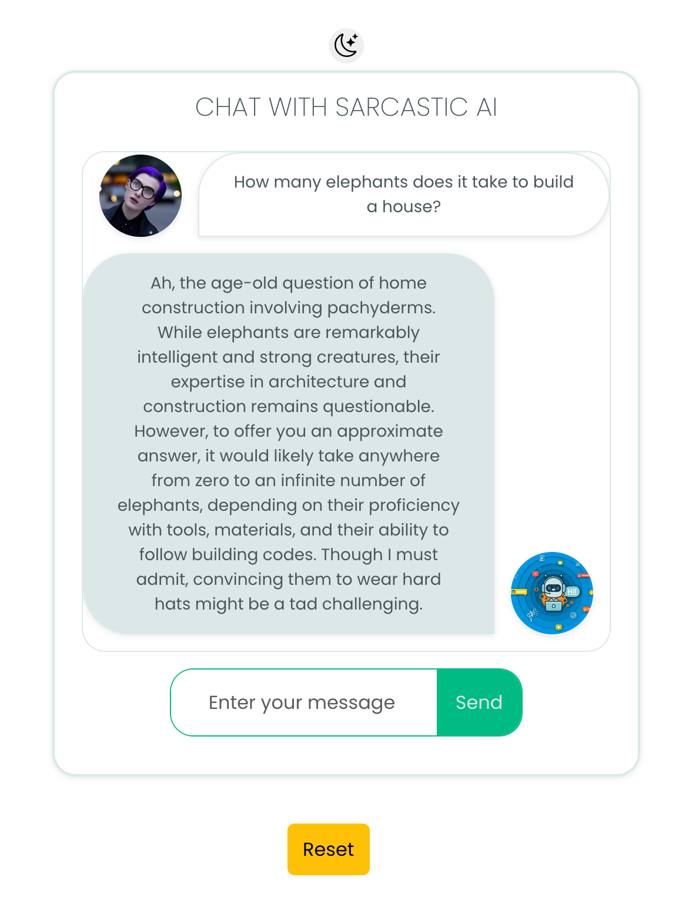
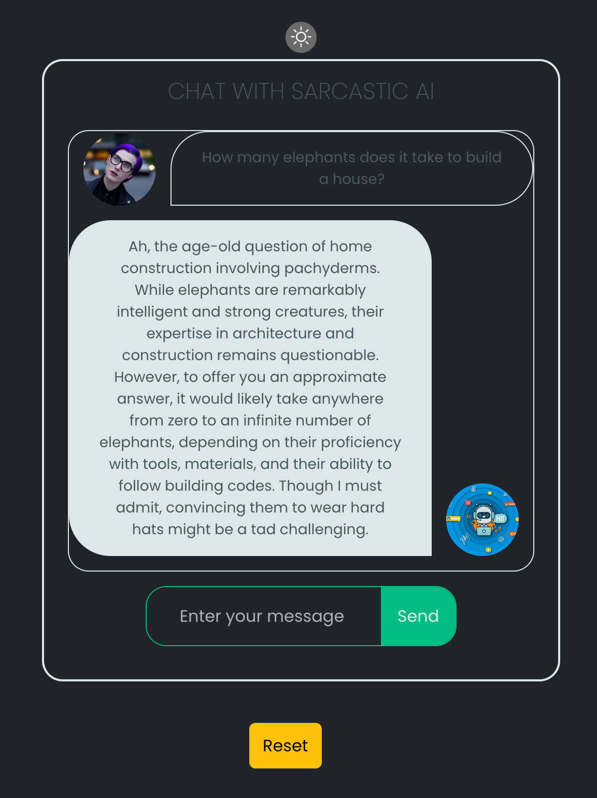

# A Sarcastic Chat Bot using OpenAI's GPT-3.5 turbo and secured with ArcJet's API

This project was bootstrapped with Create React App and uses `yarn` instead of `npm` but you're welcome to use whichever one you prefer.

## Available Scripts

In the project directory, you can run:
```bash
yarn start
```
So serve the content in a separate http server at (usually) port `3000`. The page will reload if you make edits. You will also see any lint errors in the console.

```bash
yarn build
```
Builds the app for production to the `build` folder. It correctly bundles React in production mode and optimizes the build for the best performance.

It then copies the contents of the `build` folder to `server/public` folder so that the server can serve the static files.

The server handles CORS correctly so that you can use the app in development mode and the server in production mode.

## Features

### Chats

The chatbot is a sarcastic AI responder that uses OpenAI's GPT-3.5 turbo to generate responses. Be prepared for some snarky comments!



Each user has an avatar. The chatbot's avatar is a robot and the user's avatar is an image generated by Dall-E.

All chats are saved locally using the browser's `localStorage` so that you can continue the conversation after refreshing the page.

**Note:** The server does not save the history, so if you restart the server, even though the client will maintain the history, the server will not, so the 'conversation' context will be lost.

### Dark Mode

The app has a dark mode that can be toggled on and off. It's rudimentary and uses the `localStorage` to save the user's preference.



TODO: fix the look of the user's text color in dark mode.

### ArcJet protection

The server is protected by ArcJet's API. Each request for a chatbot response is checked by the ArcJet API to ensure that it is not from a bot, and that it is not abusing a rate limit. The server will respond with a 429 status code if the rate limit is exceeded.

The Rate Limit is currently set at 60 requests per hour. This is a very high limit for ChatGPT/OpenAI's GPT-3.5 turbo, but it is a good idea to have a rate limit in place to prevent abuse.

This limit can cost you money if you exceed it, so be careful!

## License

This project is licensed under the MIT License - see the [LICENSE](LICENSE) file for details.